# SEB 44th MAIN Project 1조 T1

    

    

 

<a href="https://letsmomo.netlify.app/">
모모 체험하러 가기!
</a>

 
 

# 팀원 소개

<table>
<tr align="center">
  <td align="center">
    
  </td>
  <td style="text-align: center;">
    
  </td>
  <td style="text-align: center;">
    
  </td>
  <td style="text-align: center;">
    
  </td>
  <td style="text-align: center;">
    
  </td>
  <td style="text-align: center;">
    
  </td>
</tr>
  <tr align="center"> 
    <td><a href="https://github.com/jinsoul75">김진솔</a></td>
    <td><a href="https://github.com/Mooobi">박무생</a></td>
    <td><a href="https://github.com/shyesoo">송혜수</a></td>
    <td><a href="https://github.com/Yooney1">김윤</a></td>
    <td><a href="https://github.com/myoungincho729">조명인</a></td>
    <td><a href="https://github.com/rktdngud">최우형</a></td>
  </tr>
  <tr align="center">
    <td >FE 팀장</td>
    <td>FE</td>
    <td>FE</td>
    <td>BE 부팀장</td>
    <td>BE</td>
    <td>BE</td>
  </tr>
</table>

  
담당 파트

## FE

#### 김진솔

- 글목록 페이지 (R)
  - 글 목록
  - 필터링
  - 검색기능
- 검색결과 페이지 (R)
  - 검색 결과 가져오기
- 글 상세 페이지
  - 좋아요 기능 (CRD)
- 404 페이지
- 유저정보 페이지 (R)
  - 내가 쓴 글 목록
  - 내가 좋아요 한 글 목록
- 유저정보 수정 페이지 (U)
  - 유저 정보 수정

#### 박무생

- 글 상세 페이지
  - 글 상세 가져오기 GET
  - 글 삭제 DELETE
  - 댓글 CRUD
  - 댓글 Pagination
- 글 작성/수정 페이지
  - 글 작성 POST
  - 글 수정 PATCH
- 채팅 기능 (Websocket)
  - 웹소켓 연결, 채팅방 구독/취소
  - 일대일 채팅방 생성 POST
  - 전체 채팅 목록 가져오기 GET
  - 이전 채팅 내역 가져오기 GET
  - 실시간 채팅 보내기 POST
  - 채팅방 삭제 DELETE
  - 그룹 채팅방 생성 POST
  - 그룹 채팅방 초대 POST
  - 초대 상대 검색 자동완성 GET

#### 송혜수

- 헤더 컴포넌트
  - 로그인 여부 판별해서 각각 구현
- 공용 세미헤더 컴포넌트
- 공용 버튼 컴포넌트
- 메인 페이지
- 로그인 페이지 (C)
- 회원가입 페이지 (C)
- OAuth(카카오톡, 구글) 로그인/회원가입 (C)
  - OAuth 회원가입 후, 상세 정보 기입 페이지(U)
- 유저 정보 페이지
  - 유저의 정보 표시(R)
  - 유저 정보 수정 페이지 레이아웃

## BE

#### 김윤

- 지역 정보
- 카테고리 정보
- 게시판(CRUD)
- 검색기능
- 필터링
- 좋아요
- 내가 좋아요 누른 게시글 확인

#### 조명인

- 댓글 기능
  - 댓글 CRUD
  - 페이지네이션
- 채팅 기능
  - 채팅방 생성 - 일대일, 그룹채팅
  - 채팅방 목록
  - 채팅방 온/오프라인
  - 채팅 메세지 구분(멤버/공지)
  - 채팅방 초대
  - 채팅방 삭제
  - 안읽은 메세지 개수, 마지막 확인 시간
  - 채팅 메세지 보내기(웹소켓, 메세지 브로커)
- 배포
  - AWS 배포 - EC2, S3, RDS, ElasticCache, Route53
  - 가비아 도메인 등록
  - SSL 인증서 발급 -> HTTPS 배포

#### 최우형

- 회원정보 (CRUD)
- 로그인 / 로그아웃
- Spring Security 회원 인증/인가 처리
- JWT 토큰 기반 회원 관리
- Redis 블랙리스트 토큰 관리
- OAuth2 kakao, google 로그인

 
 

# 기술 스택

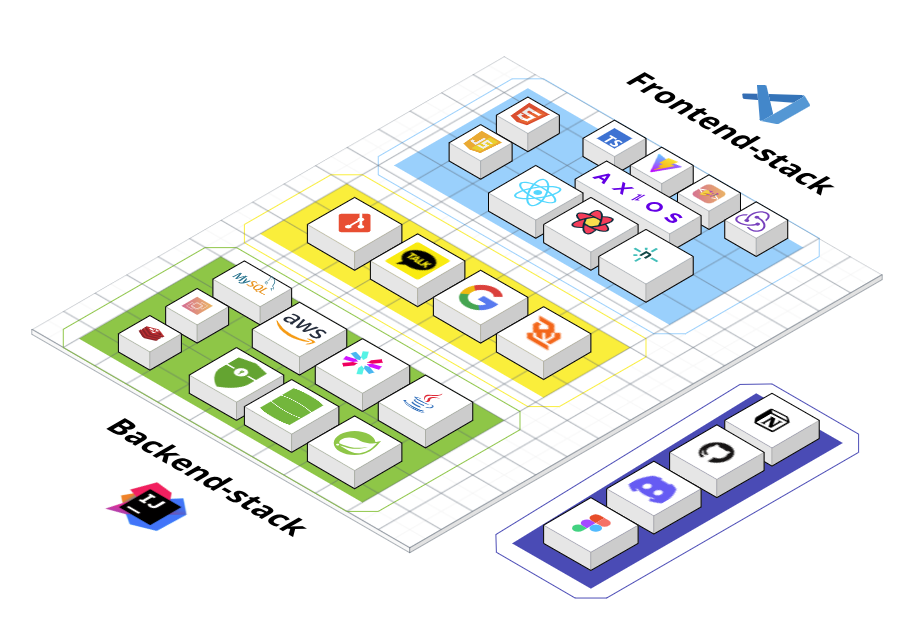

 
 

# 화면 구성

  
메인페이지

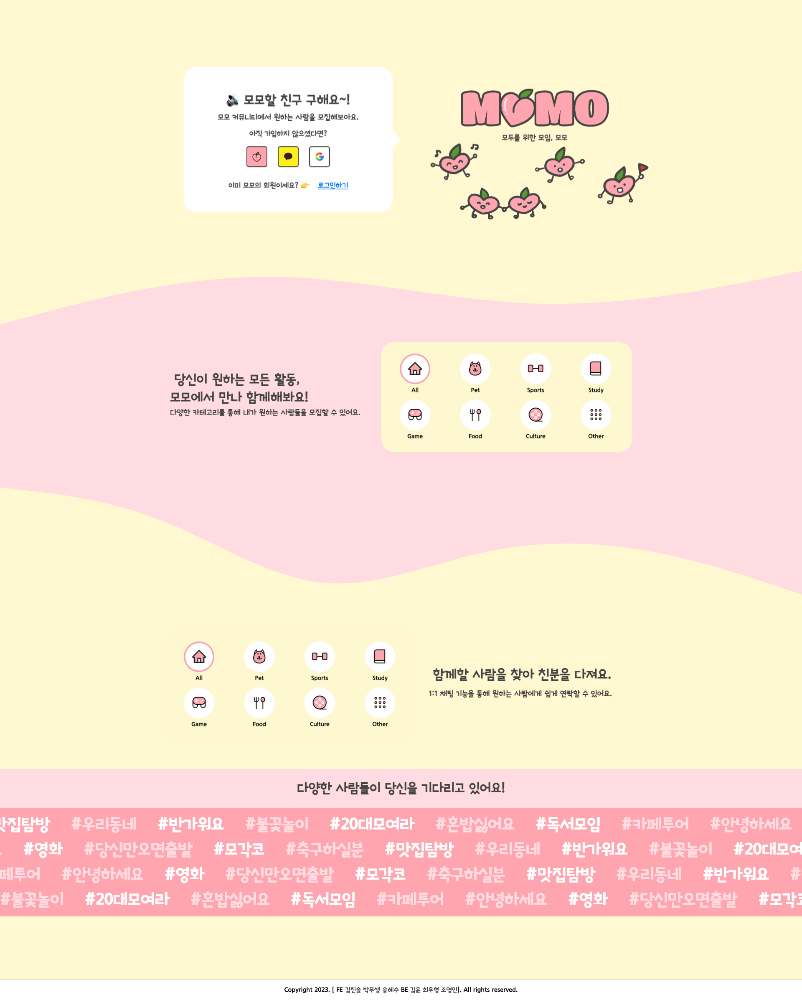

  
회원가입페이지

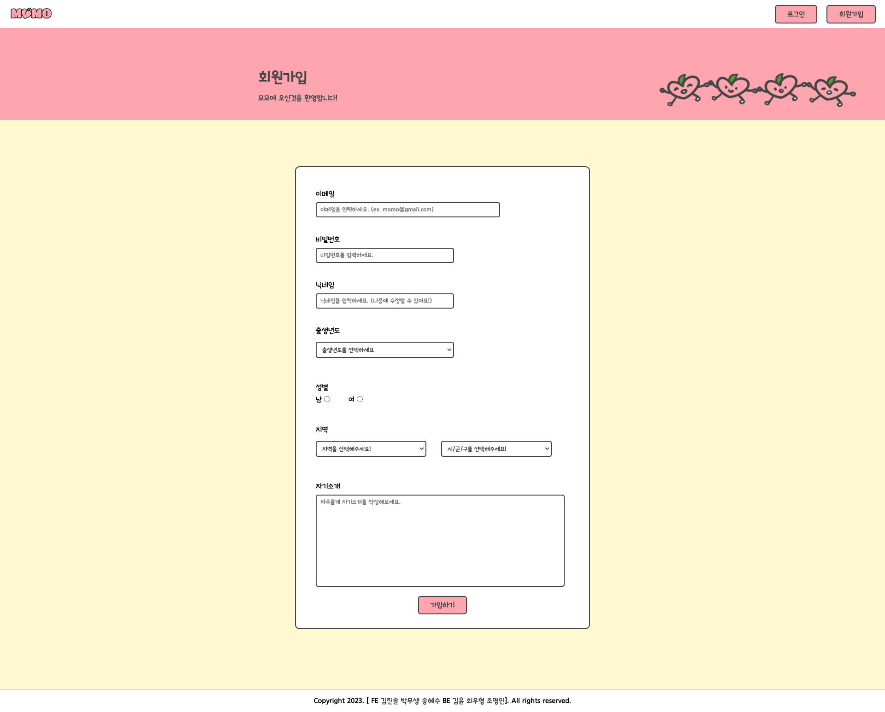

  
로그인페이지

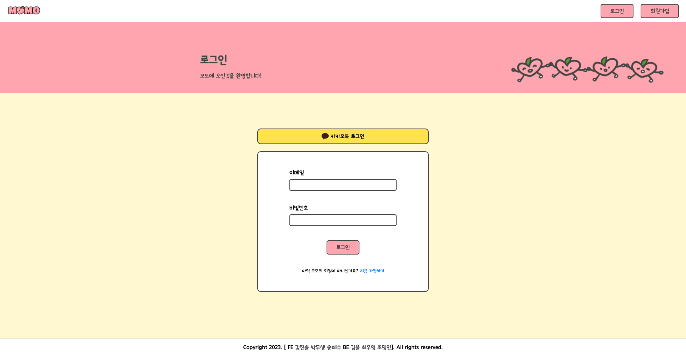

  
유저정보페이지

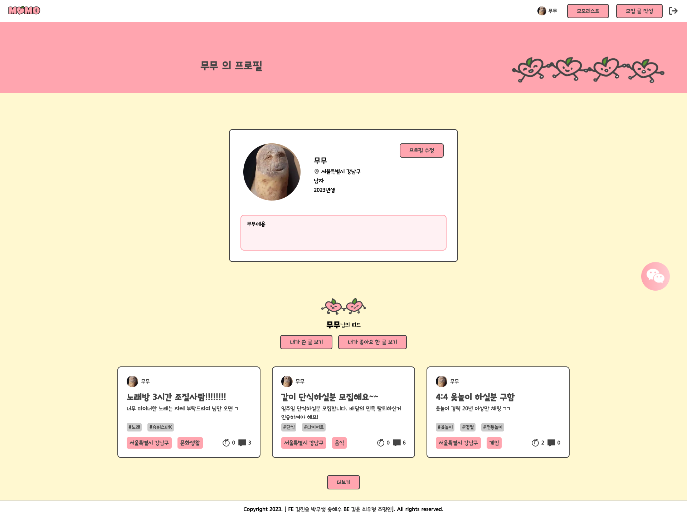

  
유저정보수정페이지

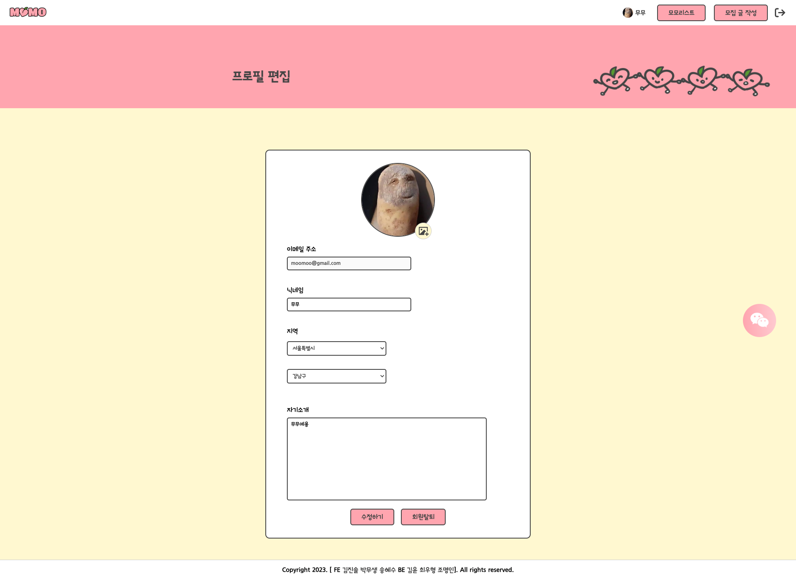

  
글작성/수정페이지

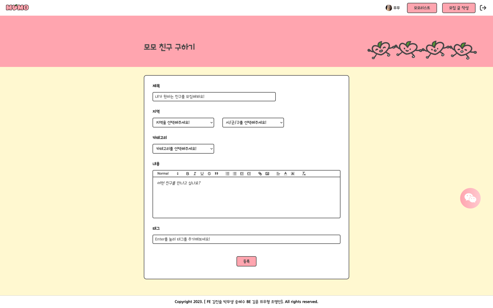

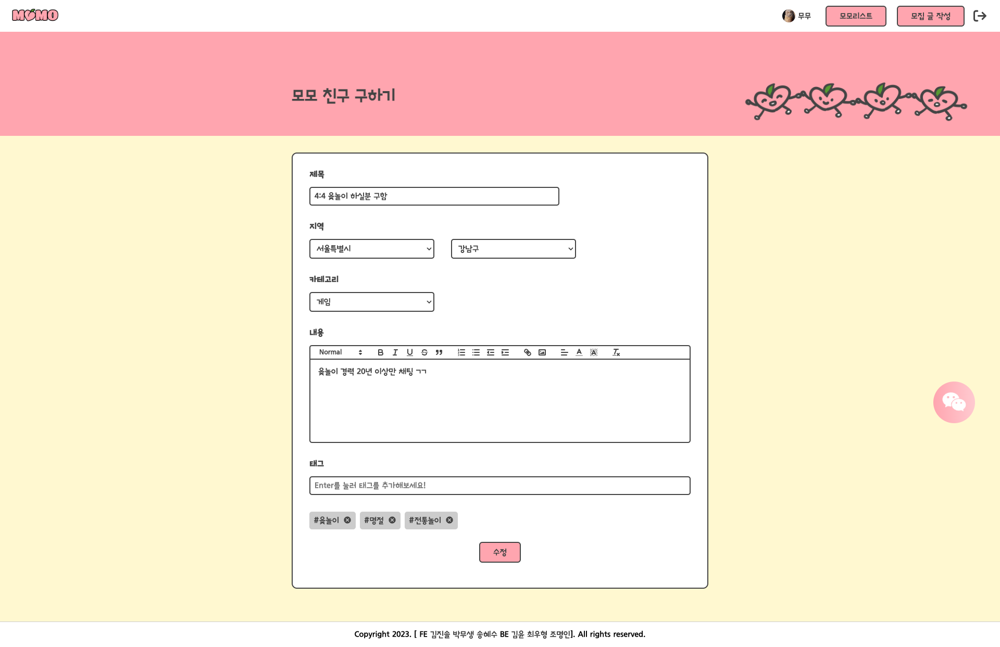

  
글목록페이지

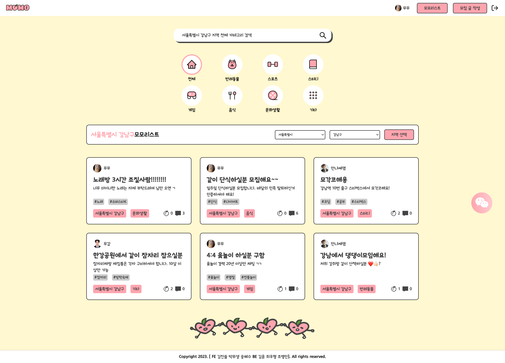

  
검색결과페이지

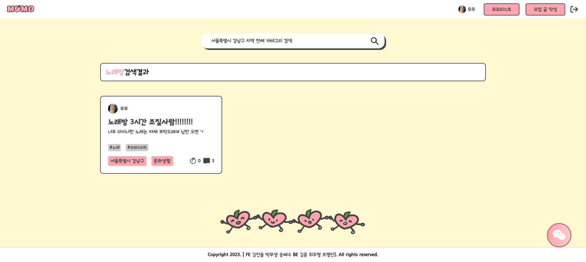

  
글상세페이지

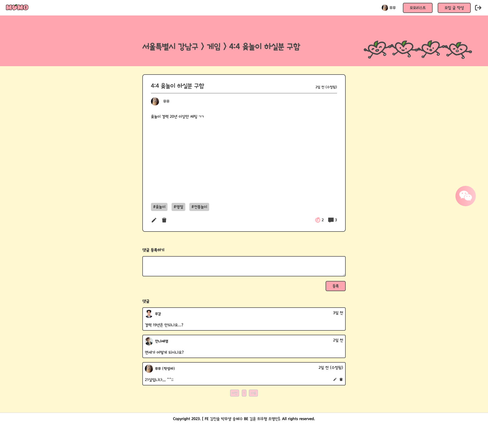

  
채팅목록

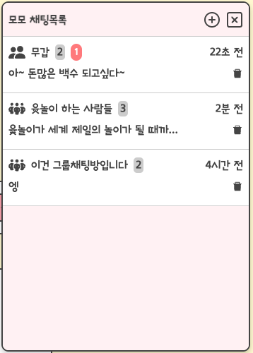

  
채팅방

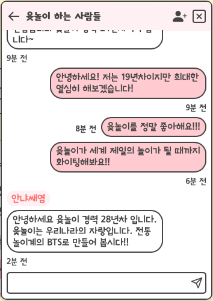

 
 

# API 명세서

<a href="https://documenter.getpostman.com/view/26572262/2s946maVGP" target="_blank">API 명세서</a>

 
 

# ERD

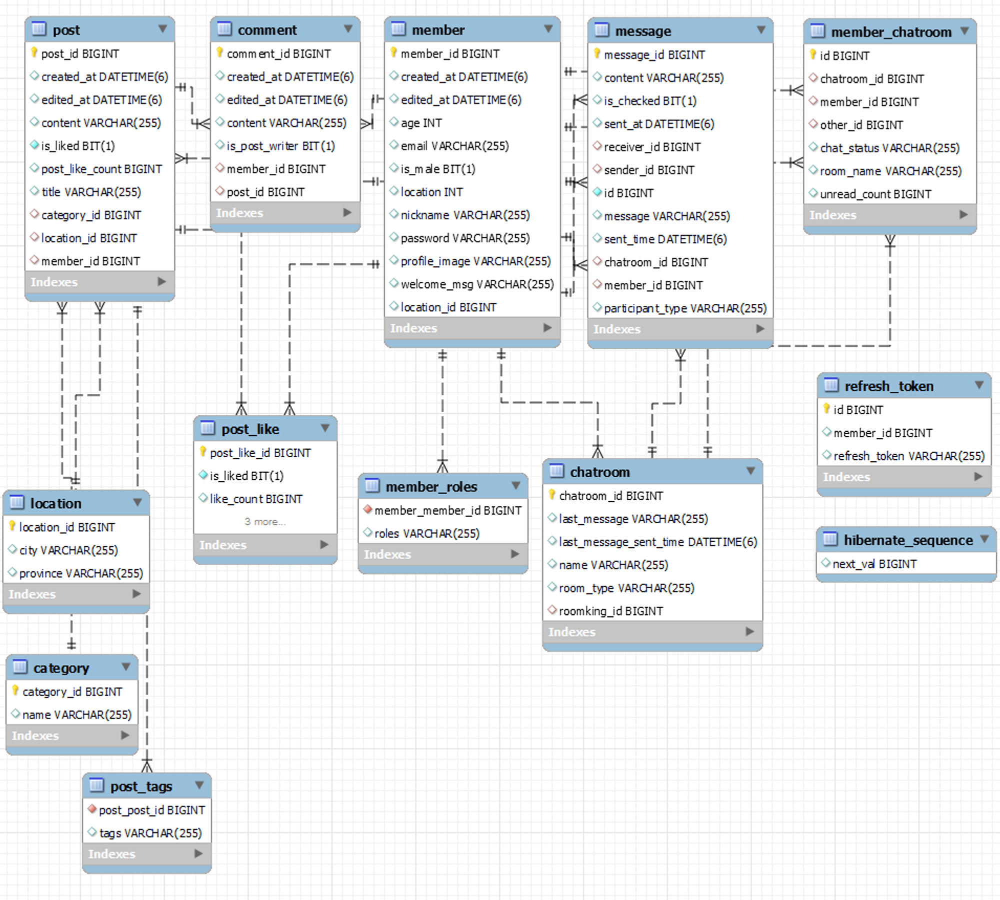

